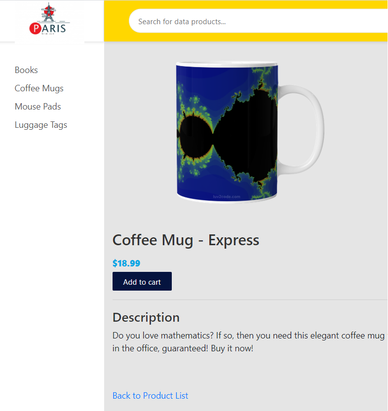

# E-Commerce 

Java (Spring Boot) & Angular  - Fullstack-app

# Installation Instructions

First clone or download as a Zip file using the green "Clone Or Download" button on the top right of the document.

Then change directory to the folder E_Commerce-master, where you will find a small node project with a `package.json`.

On the command line run the following:

    npm install

If you prefer the Yarn package manager, you can also run:

    yarn

Although npm install would also work, its recommended to use Yarn to install the course dependencies. Yarn has the big advantage that if you use it you will be
installing the exact same dependencies than I installed in my machine, so you wont run into issues caused by semantic versioning updates.
    
This should take a couple of minutes. If there are issues, please post the complete error message in the Questions section of the course.

# Starting the development server

To start the server, run the following command:

    npm start

If you now go to [http://localhost:8080](http://localhost:8080), there will be a running application at this url and then you will see the interface of the app like below

  
   
  
  
## Search for Product

  Search products with pagination These objects are (Books, Coffee Mugs, Mouse Pads and Luggage Tags).
  
  
  

## Product Detail
  
  ### Book

  ### Mugs

### Note: To run app for Angular : ng server --open

## ~ THE END~ 
